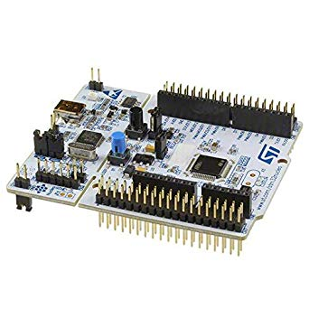
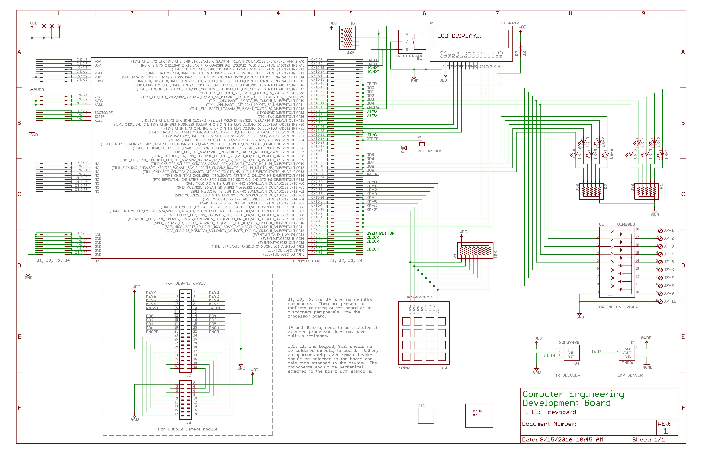

# Space Invader Game

This is the final project from the course Embedded System 2. This project was a a plane fight game by using C language to interact with keypad, LCD, and buzzer on the board.

## Micro-Controller and Board Schema

### Micro-Controller

The micro-controller of the embedded system is STM32F446RE, and the processor is ARM® Cortex®-M4 32-bit RISC core operating at a frequency of up to 180 MHz.

### Board Schema

Peripherals consists of:

* Keypad
* Buzzer
* IR Signal Receiver
* Analog-to-Digital Converter (ADC)
* LED lights
* LCD screen
* Temperature Detector.

## Build Instruction

System Workbench for STM32 is the great tool for building and deploy applications to STM32 micro-controllers. It can be downloaded from the [link](https://www.openstm32.org/Downloading+the+System+Workbench+for+STM32+installer?structure=Documentation). You can create the F446RE project, and copy code from the repo to the project and build it.

## How to use the system?

The front-end of the game is displayed on the LCD screen. The player is able to use ’2’ and ’8’ to control the movement, and ’5’ is for attacking. The background music "The Imperial March" will be played while the player is playing.

## Screenshots
